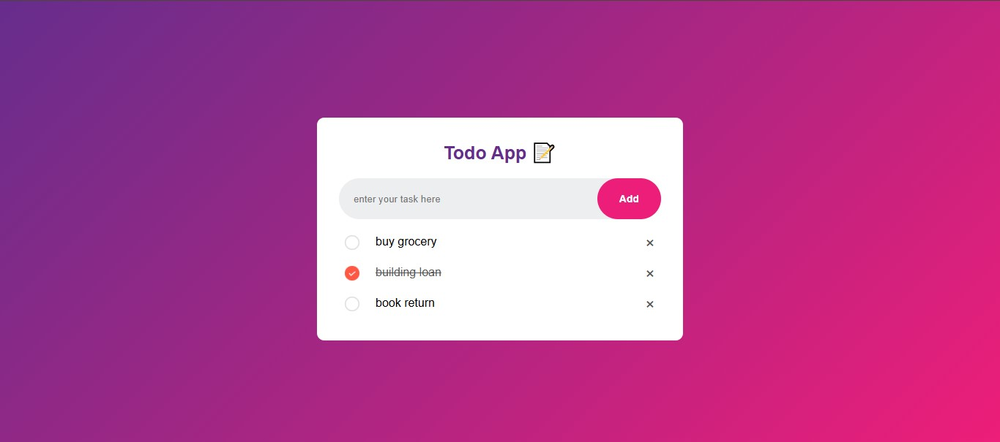

# 📝 Project 00 – To-Do List App

This is the first project in my **30 Days of JavaScript Projects** challenge.

## 🚀 Features

- ✅ Add tasks
- ❌ Delete tasks
- ✅ Mark tasks as completed
- 💾 Tasks are stored in **Local Storage** (persist after reload)
- 🎨 Clean and modern UI

## 📸 Screenshot

## 🧠 What I Learned

- DOM selection and manipulation
- Handling events like `click`
- Using `localStorage.setItem()`, `getItem()`, and `removeItem()`
- Creating dynamic elements via JavaScript

## 🛠️ Tech Stack

- HTML5
- CSS3
- Vanilla JavaScript

---
