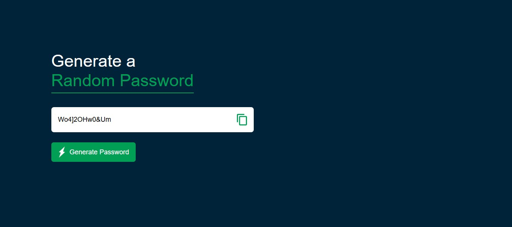

# 🔐 Project 01 – Random Password Generator

This is the second project of my **30 Days of JavaScript Projects** challenge.

The app generates a strong, random password using **Vanilla JavaScript**, and allows users to **copy it with one click**. Clean and minimal UI with responsive design.

---

## 🚀 Features

- ⚡ One-click password generation
- 📋 Copy password to clipboard
- 🔁 Random combinations of letters, numbers, and symbols
- 🎨 Styled with modern UI and responsive layout

---

## 📸 Screenshot

---

## 🧠 What I Learned

- Working with character sets and random generation
- Using execCommand
- DOM selection and event handling
- Clean UI layout using Flexbox/CSS

---

## 🛠️ Tech Stack

- HTML5
- CSS3
- Vanilla JavaScript (ES6+)

---
