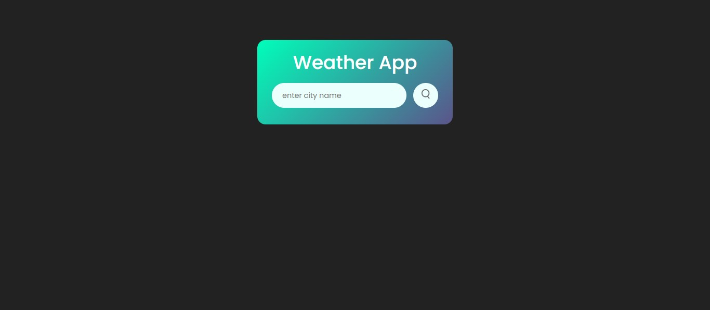
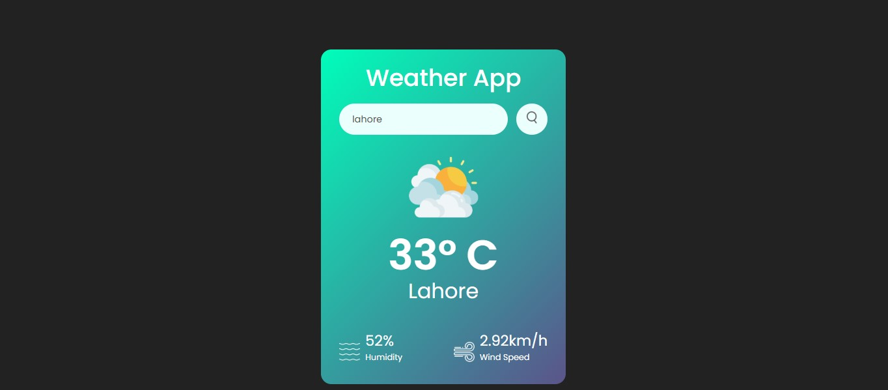

# 🌦️ Project 03 – Weather App

This is the fourth project in my **30 Days of JavaScript Projects** challenge.

The app lets you search for any city and displays the **current weather**, including temperature, humidity, and wind speed. It uses a clean UI and fetches live data from a weather API.

---

## 🚀 Features

- 🔍 Search weather by city name
- 🌡️ Displays:
  - Temperature
  - Humidity
  - Wind speed
  - Weather condition icon
- 🌐 Fetches live weather data using OpenWeatherMap API
- ❌ Handles empty or invalid city input with error messages
- 🎨 Fully responsive and modern UI

---

## 📸 Screenshot

---

## 🧠 What I Learned

- Making API calls using `fetch()`
- Handling async/await in JavaScript
- Working with JSON data from a third-party API
- DOM manipulation based on live API data
- Creating a clean, accessible form and layout

---

## 🛠️ Tech Stack

- HTML5
- CSS3
- JavaScript (ES6)
- OpenWeatherMap API

---
