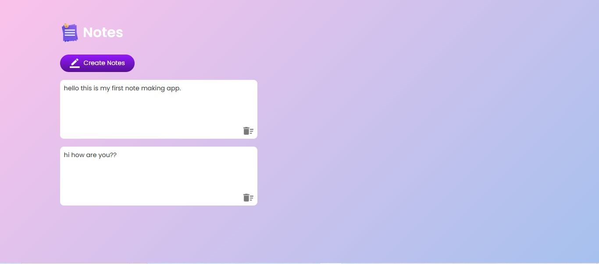

# 📝 Project 04 – Note-Taking App

This is the fifth project in my **30 Days of JavaScript Projects** challenge.

The Note-Taking App allows users to **create**, **edit**, and **delete** notes right in the browser — with automatic saving through `localStorage`. It features a clean interface with real-time saving and dynamic note creation.

---

## 🚀 Features

- ➕ Create new notes dynamically
- ✏️ Edit notes inline using `contenteditable`
- 🗑️ Delete individual notes with a single click
- 💾 Automatically saves notes using `localStorage`
- 🔄 Restores notes on page reload
- ⌨️ Prevents default `Enter` behavior for better UX

---

## 📸 Screenshot

---

## 🧠 What I Learned

- DOM manipulation using JavaScript
- Handling events dynamically (click, keyup)
- Real-time saving with `localStorage`
- Using `contenteditable` for editable elements
- Preventing default browser behavior for smoother UX

---

## 🛠️ Tech Stack

- HTML5
- CSS3
- Vanilla JavaScript (ES6)

---
