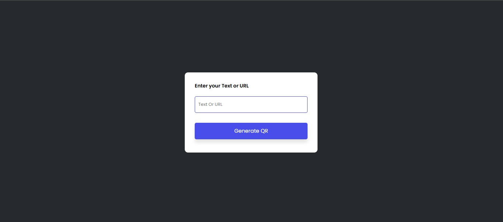
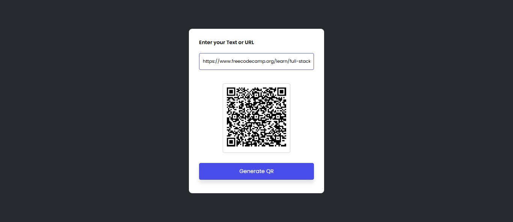

# 📱 Project 05 – QR Code Generator

This is the sixth project in my **30 Days of JavaScript Projects** challenge.

The QR Code Generator lets users input any text or URL and generates a QR code instantly using an external API. It also includes smooth UI feedback like input box animation and QR transition effects.

---

## 🚀 Features

- ✏️ Input any text or URL
- 📷 Generate a QR code instantly
- 💡 Input validation with **shake animation** if left empty
- 🌐 Fetches QR via [QRServer API](https://goqr.me/api/)
- ✨ QR code image appears with a **transition animation**
- 🎨 Simple and responsive UI layout

---

## 📸 Screenshot

---

## 🧠 What I Learned

- Making API requests using `GET` with query parameters
- Updating DOM elements dynamically (`img.src`)
- Adding CSS animations (e.g., shake on error input)
- Creating smooth UI transitions for better user experience
- Handling empty input cases cleanly

---

## 🖌️ UI Effects

| Effect                       | Implementation                             |
| ---------------------------- | ------------------------------------------ |
| 🚫 Empty Input Shake         | CSS keyframe + JS `classList.add('shake')` |
| 🌟 QR Code Fade-in Animation | CSS `opacity` and `transition`             |

---

## 🛠️ Tech Stack

- HTML5
- CSS3 (Animations & Transitions)
- JavaScript (ES6)
- [QRServer API](https://goqr.me/api/)

---
