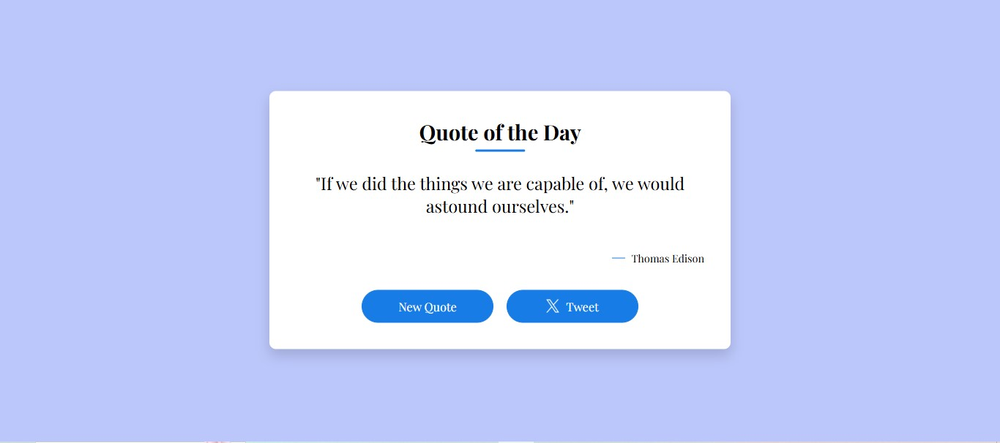
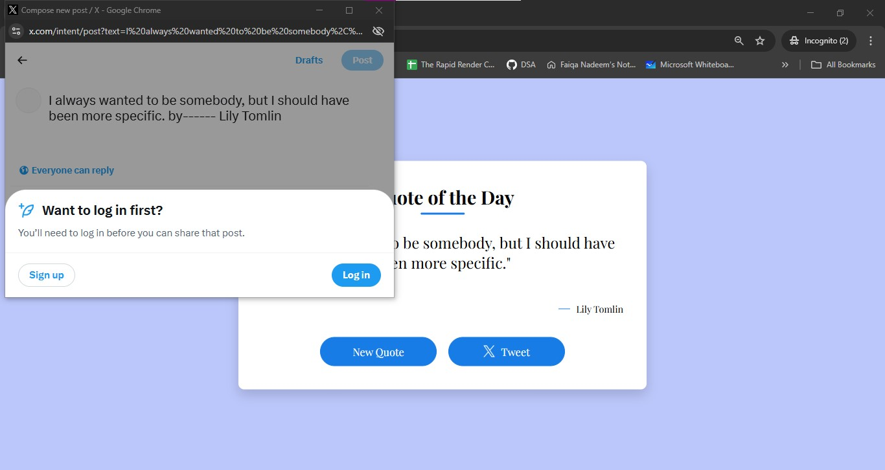

# 🧠 Project 06 – Quote of the Day App

This is the seventh project in my **30 Days of JavaScript Projects** challenge.

The **Quote of the Day** app fetches an inspiring quote using a public API and displays it beautifully. It also allows users to generate new quotes and share them directly on Twitter with a single click.

---

## 🚀 Features

- 📝 Display daily motivational quotes
- 🔄 “New Quote” button fetches a fresh quote from the API
- 🐦 “Tweet” button allows users to share quotes on Twitter
- 🌐 Uses a public quote API (e.g., [https://api.quotable.io/random](https://api.quotable.io/random))
- 💬 Elegant, responsive, and centered design

---

## 📸 Screenshot

> _(Update image path or upload to GitHub if needed)_

---

## 🧠 What I Learned

- Fetching data from a public API using `fetch()` and `async/await`
- Updating DOM elements with dynamic content
- Handling API responses and errors
- Constructing a dynamic Twitter share link using `window.open()`
- Styling quotes with accessible and minimalist design

---

## 🛠️ Tech Stack

- HTML5
- CSS3
- JavaScript (ES6)
- [Quotable API](https://api.quotable.io/)

---
