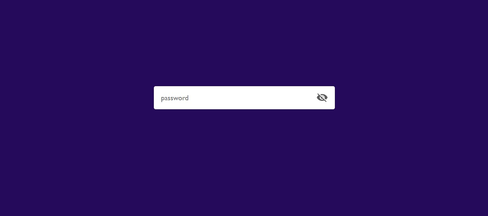
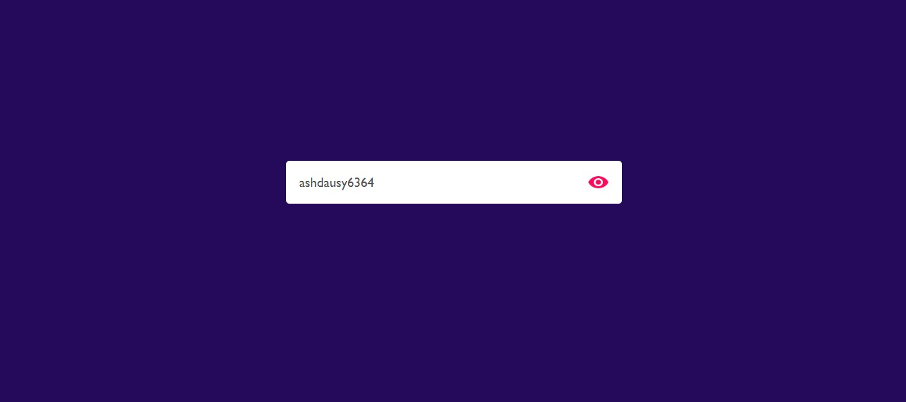

# 🔐 Project 07 – Password Visibility Toggle

This is the eighth project in my **30 Days of JavaScript Projects** challenge.

The **Password Visibility Toggle** app enhances the user experience for password input fields by allowing users to toggle between masked and visible password text using an intuitive eye icon.

---

## 🚀 Features

- 👁️ Eye icon toggles password visibility
- 🔒 Secure default behavior (`type="password"`)
- 🔁 Dynamic switching between `type="password"` and `type="text"`
- 🎨 Smooth and responsive UI
- ✅ Mobile-friendly design with minimal styling

---

## 📸 Screenshot

---

## 🧠 What I Learned

- Manipulating input field attributes with JavaScript
- Toggling UI icons dynamically (eye / eye-slash)
- Enhancing UX for common form fields
- Writing clean, accessible UI code
- Responsive styling and subtle transitions

---

## 🛠️ Tech Stack

- HTML5
- CSS3
- JavaScript (ES6)

---
