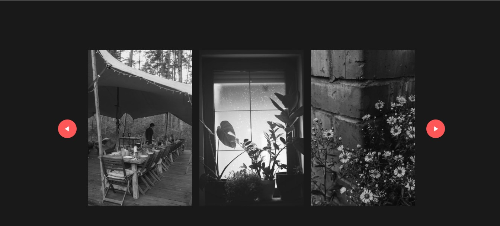

# 🖼️ Project 08 – Gallery Slider

This is the ninth project in my **30 Days of JavaScript Projects** challenge.

The **Gallery Slider** allows users to scroll through a horizontal gallery of images using both the **mouse wheel** and **navigation buttons**. It's smooth, responsive, and perfect for displaying photo collections in a modern layout.

---

## 🚀 Features

- 🖱️ Horizontal scroll using the mouse wheel
- ⬅️➡️ Back and Next buttons to slide images
- ✨ Smooth scrolling behavior with transitions
- 💡 Auto vs Smooth scroll behavior based on interaction
- 📱 Fully responsive and user-friendly design

---

## 📸 Screenshot

---

## 🧠 What I Learned

- How to use `scrollLeft` to scroll elements horizontally
- Handling `wheel` events to create custom scroll behavior
- Toggling `scrollBehavior` between `"auto"` and `"smooth"`
- DOM manipulation with button clicks
- Creating a better UX through subtle interaction improvements

---

## 🛠️ Tech Stack

- HTML5
- CSS3
- JavaScript (ES6)

---
