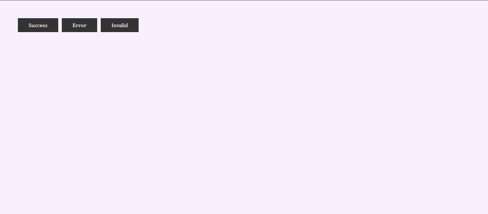
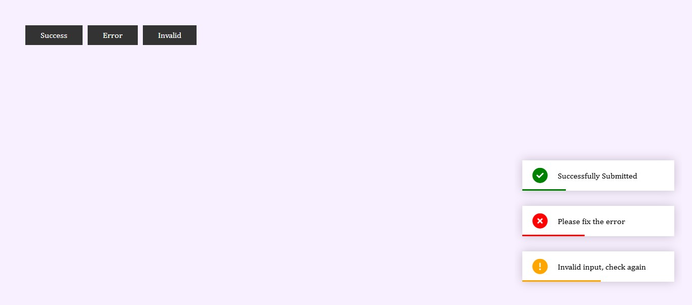

# 🔔 Project 09 – Toast Notification

This is the tenth project in my **30 Days of JavaScript Projects** challenge.

The **Toast Notification** app is a lightweight UI component that displays quick feedback messages (success, error, invalid) to users in response to certain actions. It's commonly used in forms, dashboards, or anywhere instant feedback is required.

---

## 🚀 Features

- ✅ **Success, Error, and Invalid toast types**
- 🧩 Click-based buttons to trigger notifications
- 🎨 Styled alerts with unique icons and colors
- ⏱️ Auto-disappear after a few seconds
- 🧼 Clean animation and visual feedback
- 📱 Fully responsive and accessible design

---

## 📸 Screenshots

### 🔘 Before Toasts

### 🔔 Active Toasts

---

## 🧠 What I Learned

- DOM manipulation and event handling in JavaScript
- Creating and styling toast messages dynamically
- Handling multiple toasts and timing with `setTimeout`
- UI feedback principles for better user experience
- Using CSS for smooth entrance and exit transitions

---

## 🛠️ Tech Stack

- HTML5
- CSS3 (Flexbox + animations)
- JavaScript (Vanilla ES6)

---
