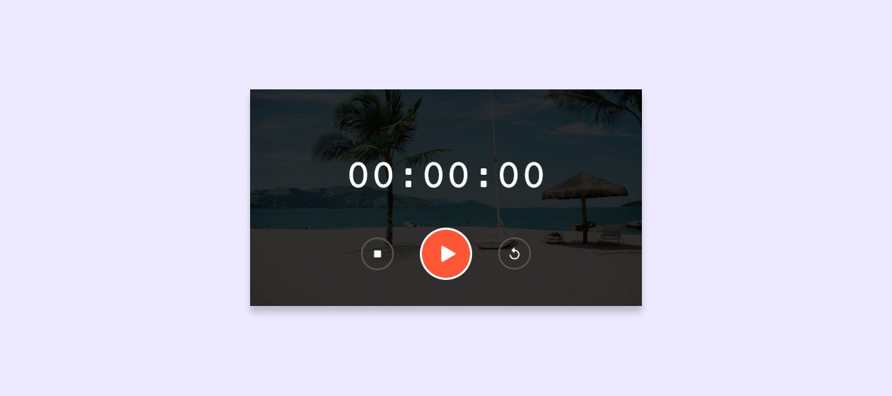
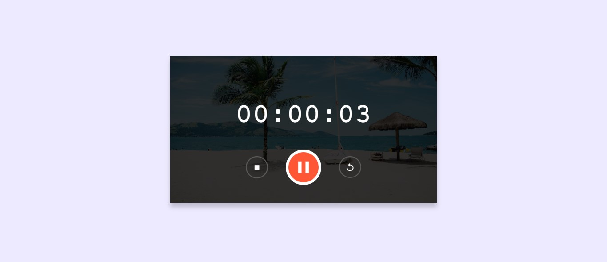

# ⏱️ Project 11 – Stopwatch

This is the twelfth project in my **30 Days of JavaScript Projects** challenge.

## 📌 Project Title: Stopwatch Web App

A simple yet beautiful stopwatch application built using HTML, CSS, and JavaScript. It includes functionality to **start**, **pause**, **reset**, and **stop** the timer with a clean, aesthetic interface and a tropical beach background for a calm and focused vibe.

---

## 🚀 Features

- Start, stop, and reset functionality.
- Real-time display in `HH : MM : SS` format.
- Stylish background with shadow effects.
- Intuitive and responsive button icons.

---

## 🧠 What I Practiced

- DOM Manipulation using JavaScript.
- `setInterval()` and `clearInterval()` usage.
- Event handling and UI control logic.
- Time formatting using JS.
- Styling circular icons using Flexbox and CSS shadows.

---

## 📸 Screenshot

---

## 🛠️ Built With

- HTML5
- CSS3
- JavaScript (ES6)

---

## 🏁 Final Thoughts

Creating a stopwatch gave me hands-on experience with time calculations, UI interactivity, and control flow. It was both fun and rewarding to see it work smoothly. On to the next one!
