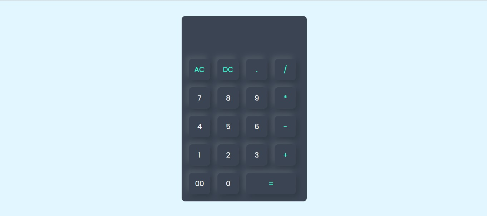
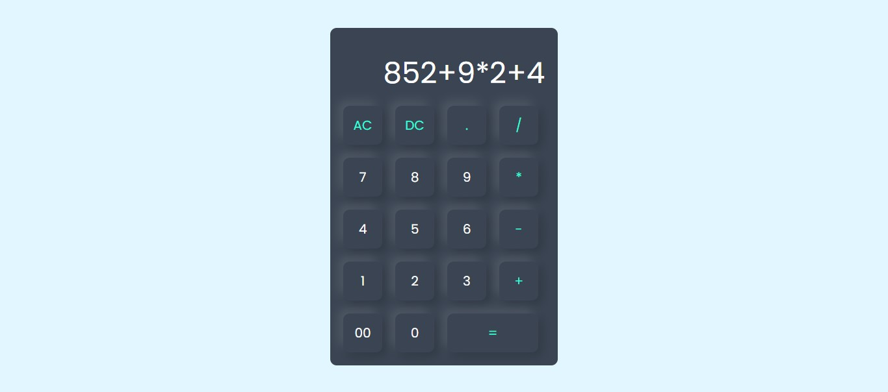

# 🧮 Project 12 – Neumorphic Calculator

This is the thirteenth project in my **30 Days of JavaScript Projects** challenge.

A fully functional **Neumorphic Calculator** built using **HTML, CSS, and JavaScript**. This project combines beautiful soft-shadow UI with complete arithmetic functionality, making it both a design and logic showcase.

---

## 📸 Screenshot

---

## ✨ Features

- 🟣 Neumorphic design for modern, soft UI
- 🔢 Full calculator functionality using JavaScript
- 🔁 Handles multiple operations like `+`, `-`, `*`, `/`, `%`, and decimals
- 🧼 Includes All Clear (AC) and Delete (DC) options
- 💻 Responsive and interactive button press animation

---

## 🛠️ Technologies Used

- HTML5
- CSS3 (Neumorphism Design)
- JavaScript (Vanilla)

---
