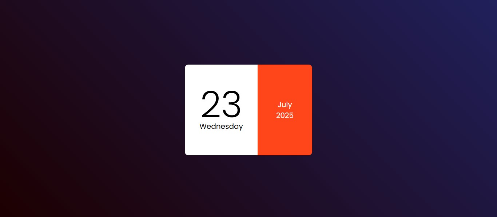

# 📅 Project 13 – Mini Calendar

This is the fourteenth project in my **30 Days of JavaScript Projects** challenge.

## 📌 Description

The **Mini Calendar** is a simple yet elegant widget that dynamically displays the **current date**, **day**, **month**, and **year** using **HTML, CSS, and JavaScript**. It's visually appealing with a clean layout and a split design using modern color schemes.

## 🎨 Features

- 📆 Dynamically fetches and displays the **current date**
- 🗓️ Shows the **day of the week**
- 📅 Displays the **month and year**
- 💡 Responsive & centered card layout
- 🎨 Beautiful split color card (white + vibrant orange)
- 🌌 Dark-to-light gradient background

## 🧠 What I Learned

- Working with the JavaScript `Date` object
- Extracting date values like day, month, year, and weekday
- Flexbox layout and element centering
- Designing modern UI cards with split color sections
- Creating reusable and minimal calendar UIs

## 📸 Preview

## 🛠️ Technologies Used

- HTML5
- CSS3 (Flexbox, Gradients)
- JavaScript (Date Object)
