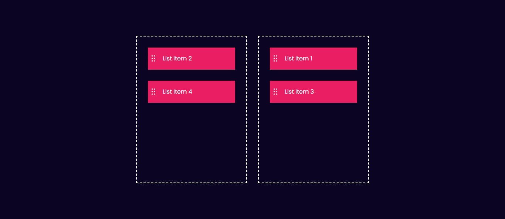

# 📦 Project 14 – Drag and Drop

This is the fifteenth project in my **30 Days of JavaScript Projects** challenge — a simple and interactive **Drag and Drop** feature built using **HTML, CSS & JavaScript**.

It demonstrates how to make elements draggable and how to handle drag events to allow smooth interaction between containers.

---

## 🚀 Features

- 🎯 Drag items between two containers
- 📦 Visual feedback on draggable items
- 🖱️ Custom styles for drag-over state
- 📱 Fully responsive and clean layout
- ⚙️ Built with only HTML, CSS, and Vanilla JavaScript

---

## 💡 What I Learned

- Using the **HTML5 Drag and Drop API**
- Handling events: `dragstart`, `dragover`, `drop`, etc.
- Working with `dataTransfer` to pass element data
- Providing real-time visual feedback during interactions
- Writing modular, event-driven JavaScript logic

---

## 📸 Screenshots

---

## 🛠️ Tech Stack

- HTML5
- CSS3
- JavaScript (ES6)

---

## 📅 Challenge Progress

✅ 15 / 30 JavaScript projects complete!

Stay tuned for more exciting UI interactions and mini tools in this coding journey 🚀
