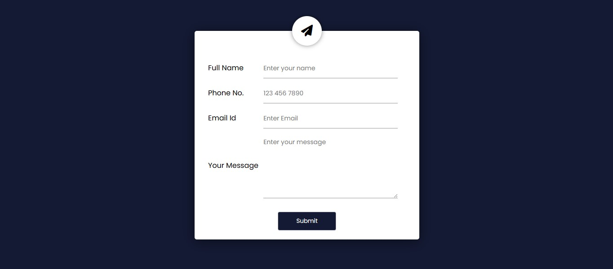
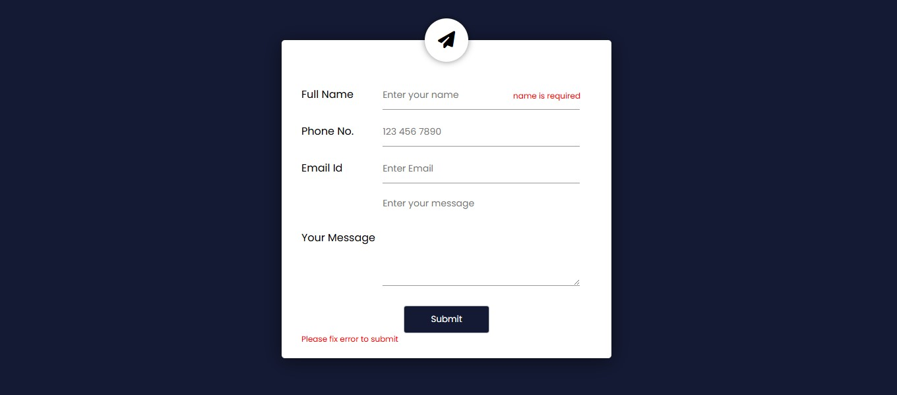

# 🚀 Project 15 – Form Validation

This is the sixteenth project in my **30 Days of JavaScript Projects** challenge.  
I created a **Form Validation** project using **HTML, CSS & JavaScript** to validate user inputs in real-time before submission.

## 📌 Overview

The project includes a user-friendly form that validates name, email, and phone fields with immediate visual feedback. It helps users correct errors as they type and ensures that only valid data is submitted.

---

## 💡 Features

- ✅ Real-time validation for all form fields
- 📧 Email pattern matching using Regex
- 🔴 Error messages and visual cues for invalid input
- 🟢 Successful submission alert

---

## 📸 Preview

---

## 🧠 What I Learned

- Form input validation techniques
- Regex for pattern matching
- Dynamically updating DOM elements
- Real-time error feedback and styling
- Writing clean and reusable JavaScript functions

---

## 🛠️ Built With

- **HTML**
- **CSS**
- **JavaScript (Vanilla)**

---
