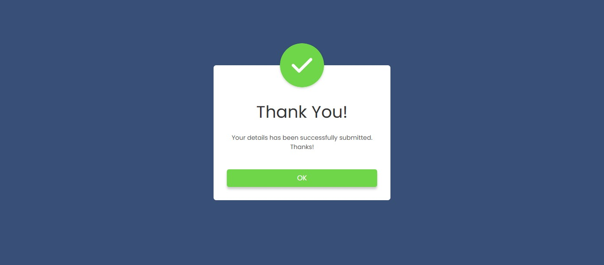

# 📌 Project 16 – Popup

This is the seventeenth project in my **30 Days of JavaScript Projects** challenge.

---

## 🚀 Overview

The **Popup Project** is a simple and elegant implementation of a modal-style popup using **HTML, CSS, and JavaScript**. It showcases how to trigger and dismiss a popup window for various purposes like alerts, subscriptions, or messages.

---

## 🌟 Features

- 👆 Click-to-open popup modal
- ❌ Close button to hide the popup
- 🎯 Centered modal with overlay
- 💡 Clean and modern UI
- ⚡ Smooth transition effects

---

## 📸 Preview

---

## 📚 What I Learned

- How to use `classList.add()` and `remove()` for toggling visibility
- Handling user interaction with JavaScript
- Styling and positioning modals using CSS
- Working with overlay effects

---

## 🛠️ Tech Stack

- HTML
- CSS
- JavaScript

---
