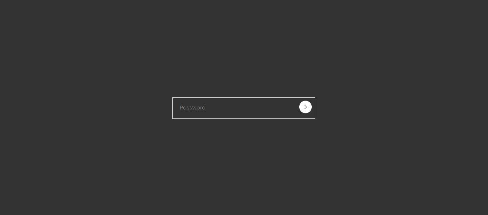
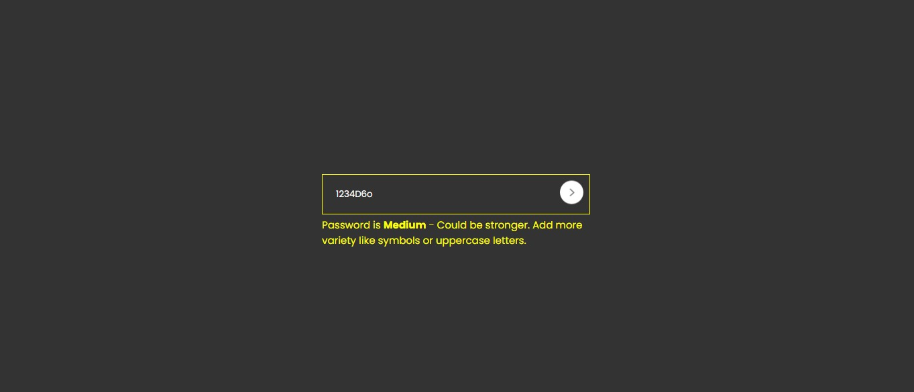

# 🔐 Project 17 – Password Strength Indicator

This is the eighteenth project in my **30 Days of JavaScript Projects** challenge.

A **Password Strength Indicator** built using **HTML, CSS, and JavaScript**, which gives users real-time feedback on how strong or weak their entered password is.

---

## 📸 Preview

---

## 💡 Features

✅ Live password strength evaluation  
✅ Strength levels: Weak, Medium, Strong  
✅ Visual feedback using colored bars  
✅ Strength updates as the user types  
✅ Simple, clean, and responsive design  
✅ Built using only Vanilla JavaScript, HTML & CSS

---

## 🧠 What I Learned

- Handling real-time input events in JavaScript
- Building dynamic UI elements using DOM manipulation
- Implementing regex-based strength evaluation logic
- Designing clear visual feedback for UX clarity
- Structuring CSS for responsive layouts

---

## 🚀 Technologies Used

- HTML5
- CSS3 (Flexbox)
- JavaScript (Vanilla)

---
