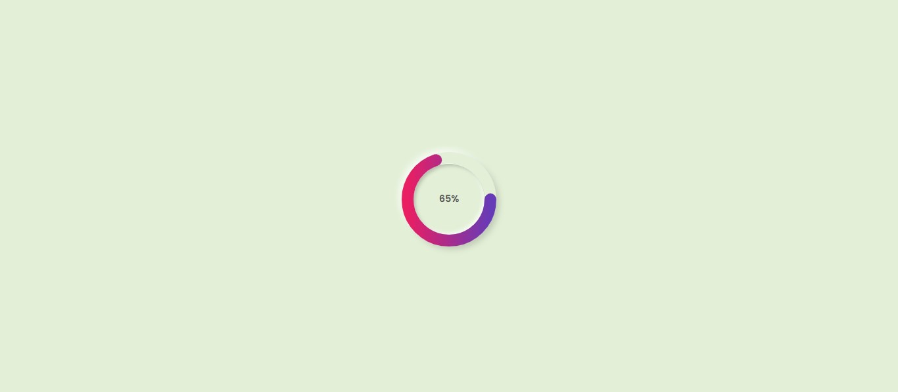

# 🎯 Project 18 – Circular Progress Bar

This is the nineteenth project in my **30 Days of JavaScript Projects** challenge.

## 📌 Project Title: Animated Circular Progress Bar

A clean and animated circular progress bar built with HTML, CSS, and JavaScript. The bar visually fills from 0% to 65% with a smooth transition, updating the percentage dynamically.

---

## 🚀 Features

- Circular stroke progress animation using `stroke-dashoffset`
- Centered percentage text that updates in real time
- Soft Neumorphism-style design using `box-shadow`
- Animated using `@keyframes` and `setInterval`
- Fully responsive and lightweight

---

## 🧠 What I Practiced

- Working with SVG and stroke animation
- Using JavaScript's `setInterval()` for live counter updates
- Matching JavaScript timing with CSS animation
- Creating elegant UI with Neumorphism styling
- Using gradients and stroke properties in SVG

---

## 📸 Screenshot

---

## 🛠️ Built With

- HTML5
- CSS3 (Neumorphism + Gradient)
- Vanilla JavaScript

---

## 🏁 Final Thoughts

Creating this circular progress bar was a fun exercise in combining SVG, animation, and JS logic. It’s a perfect UI component for dashboards or loading indicators.
