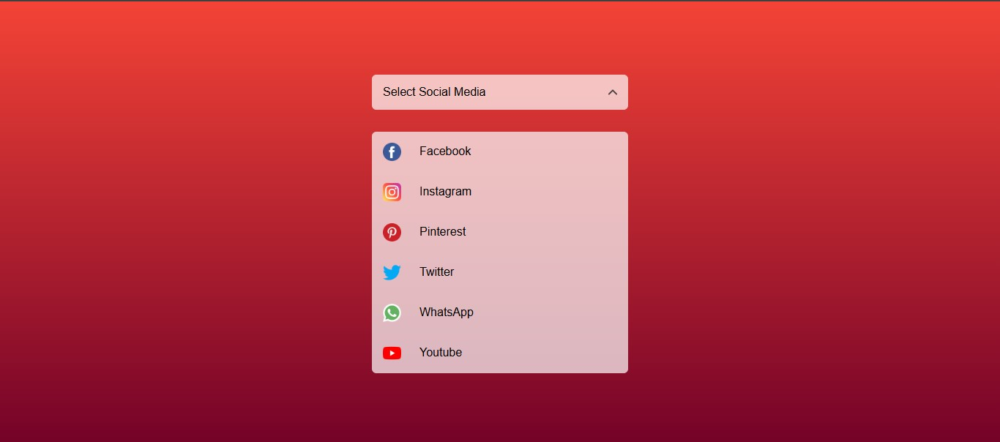

# 🚀 Project 20 – Social Media Menu Design

This is the twenty first project in my **30 Days of JavaScript Projects** challenge.

## 📌 Project Overview

The **Social Media Dropdown Menu** is a sleek and minimal dropdown interface that reveals a list of popular social media links upon selection. Built with clean UI and smooth interaction using HTML, CSS, and JavaScript.

### 🧪 Live Features

- 🔘 Click-to-toggle dropdown interaction
- 🌐 List of major social platforms: Facebook, Instagram, Pinterest, Twitter, WhatsApp, YouTube
- 🎨 Gradient background with modern styling
- ✅ Fully responsive and accessible layout

---

## 🚀 Technologies Used

- **HTML5** – structure
- **CSS3** – styling & transitions
- **JavaScript** – toggle functionality

---

## 📸 Preview

---

## 🧠 What I Learned

- Toggling classes via JavaScript for UI states
- Creating accessible and intuitive dropdowns
- Enhancing visual appeal with icons and layout
- Clean separation of structure, style, and logic

---
