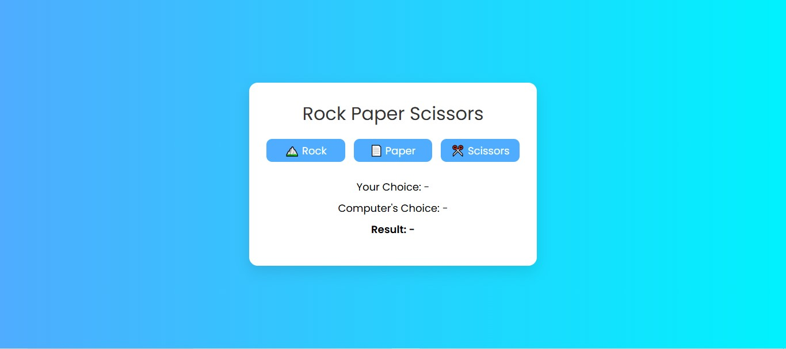
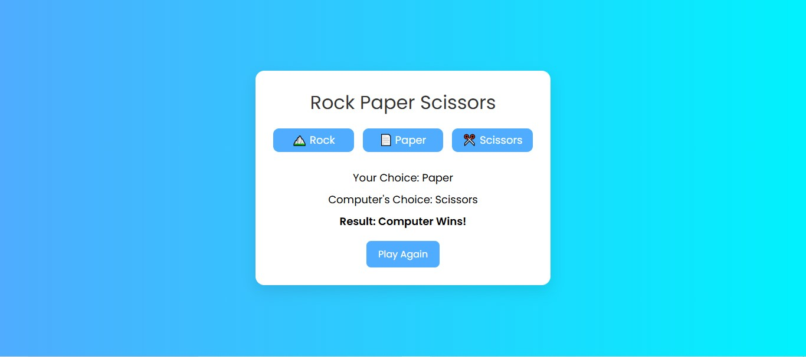

# 🚀 Project 21 – Social Media Menu Design

This is the twenty second project in my **30 Days of JavaScript Projects** challenge.

# 🎮 Rock Paper Scissors Game

A simple and interactive Rock Paper Scissors game built using **HTML**, **CSS**, and **JavaScript**. Challenge the computer, test your luck, and enjoy the fun UI with emojis and animations!

---

## 📸 Preview

---

## 🚀 Features

- 🎨 Clean and modern UI
- 🧠 Random computer choice generation
- ✅ Win/Lose/Draw logic implementation
- 🔁 "Play Again" functionality
- 💻 Fully responsive design

---

## 🛠️ Technologies Used

- **HTML5** – Structure of the app
- **CSS3** – Styling and layout
- **JavaScript** – Game logic and interactivity

---

## 📚 What I Learned

- Handling DOM events and updating elements dynamically
- Implementing game logic using conditionals
- Adding user interaction feedback using styles and text updates
- Resetting UI states effectively

---

## ▶️ How to Play

1. Click on **Rock**, **Paper**, or **Scissors** to make your move.
2. The computer makes a random choice.
3. The result is displayed: Win, Lose, or Draw!
4. Click **Play Again** to restart the game.

---
