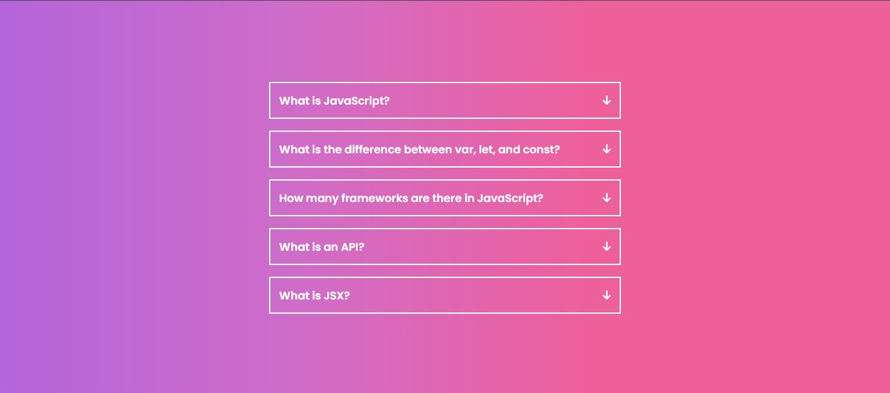
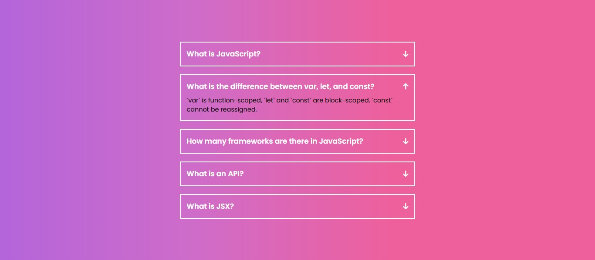

# 🚀 Project 23 – FAQ Accordion Component

This is the twenty-fourth project in my **30 Days of JavaScript Projects** challenge.

# 📂 FAQ Accordion using HTML, CSS, and JavaScript

A clean and interactive **FAQ Accordion** component built with **HTML**, **CSS**, and **JavaScript**. Clicking a question reveals the answer in a smooth and intuitive dropdown format — perfect for FAQ sections or toggle content displays.

---

## 📸 Preview

---

## 🚀 Features

- 🧾 Multiple accordion items with toggle behavior
- 🔽 Click to expand/collapse functionality
- 🎨 Gradient background and clean layout
- 📱 Fully responsive design
- 💡 Simple and minimal UI

---

## 🛠️ Technologies Used

- **HTML5** – For semantic structure
- **CSS3** – For styling and transitions
- **JavaScript** – For toggle functionality and dynamic class handling

---

## 📚 What I Learned

- How to toggle active classes using JavaScript
- Creating collapsible sections with smooth height transitions
- Structuring accordion components with accessible markup
- Using icons and CSS transitions for better UX

---

## ▶️ How It Works

1. The page loads with all questions collapsed.
2. When a user clicks on a question, it expands to show the answer.
3. Clicking again collapses it, or clicking another item toggles it open.
4. Only one question can be open at a time (optional behavior).

---
