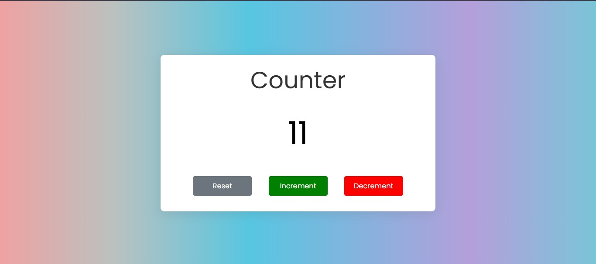

# 🚀 Project 24 – Counter App

This is the twenty-fifth project in my **30 Days of JavaScript Projects** challenge.

# 🔢 Counter Using HTML, CSS, and JavaScript

A simple and interactive **Counter App** that lets you increment, decrement, and reset a number using three buttons. Built using **HTML**, **CSS**, and **JavaScript**, this is a great project for mastering basic DOM manipulation and event handling.

---

## 📸 Preview

---

## 🚀 Features

- ➕ Increment the count
- ➖ Decrement the count (no negative values)
- 🔄 Reset the count to zero
- 🎨 Button color indicators (Green for Increment, Red for Decrement, Gray for Reset)
- 📱 Responsive design

---

## 🛠️ Technologies Used

- **HTML5** – For markup and structure
- **CSS3** – For layout and styling
- **JavaScript** – For dynamic behavior and event handling

---

## 📚 What I Learned

- Accessing and updating DOM elements
- Handling button click events
- Managing state using variables
- Preventing UI bugs by syncing logic and visuals
- Adding visual feedback using colors and layout

---

## ▶️ How It Works

1. The counter starts at **0**.
2. Clicking **Increment** increases the value by 1.
3. Clicking **Decrement** decreases the value by 1, but not below 0.
4. Clicking **Reset** sets the count back to **0** and updates the UI accordingly.

---
