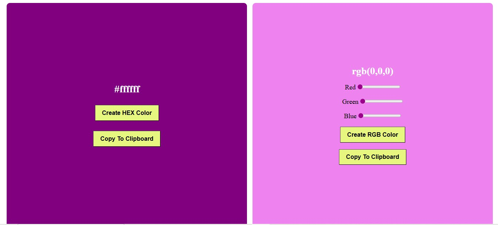

# 🎨 Random Color Generator – HEX & RGB | Project 25/30

This is the twenty-sixtth project in part of my **30 Days of JavaScript Projects** challenge. It generates **random HEX and RGB colors** and allows users to **copy** them to the clipboard with a click.

## 📌 Features

✅ Generate random HEX color  
✅ Generate custom RGB color using sliders  
✅ Live background color update  
✅ Copy color value to clipboard  
✅ Simple and responsive layout  
✅ Clean and vibrant UI

---

## 📸 Preview

---

## 🛠️ Technologies Used

- HTML
- CSS
- JavaScript

---

## 🚀 How It Works

### HEX Generator

- Clicking the `Create HEX Color` button generates a random HEX value and changes the background color.
- The `Copy To Clipboard` button copies the HEX code.

### RGB Generator

- Use sliders to control **Red**, **Green**, and **Blue** values.
- Click `Create RGB Color` to apply the color.
- Click `Copy To Clipboard` to copy the RGB code.

---

## 💡 What I Learned

- Working with `Math.random()` to generate HEX codes
- Using RGB sliders with `input[type=range]`
- Updating UI dynamically with `style.backgroundColor`
- Copying text to clipboard using `navigator.clipboard.writeText()`
- Handling DOM events efficiently

---
