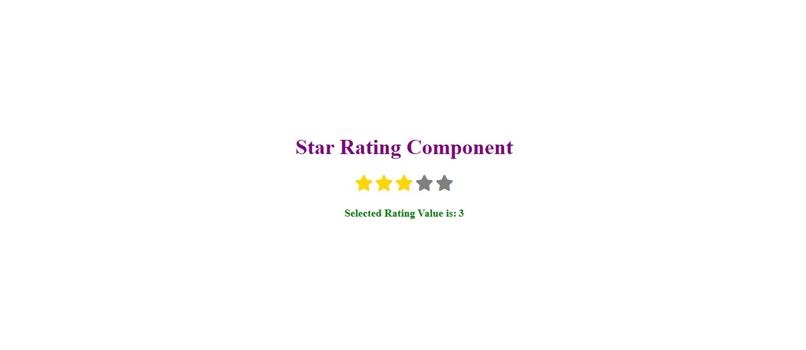

# ⭐ Project 27 – Simple Star Rating

A clean and interactive **Star Rating Component** built using **HTML, CSS, and JavaScript**.

This component allows users to click on stars to provide a rating out of 5. The selected stars are highlighted, and the current rating value is displayed below the stars in real-time.

---

## 📌 Features

- ⭐ Clickable star rating (1–5)
- 🎨 Stars change color on selection
- 💡 Displays selected rating value dynamically
- 🔄 Fully resettable by clicking again
- 💻 Responsive and simple UI

---

## 🛠️ Built With

- HTML5
- CSS3
- JavaScript (Vanilla)

---

## 🚀 How It Works

- Each star is clickable using a `click` event.
- Selected stars are filled with a yellow color.
- Remaining stars stay grey.
- The selected rating is shown just below the stars.

---

## 📸 Preview

---

## ✅ What I Learned

- Handling DOM elements dynamically
- Adding and removing classes
- Managing active state of UI elements
- Improving UI feedback for better user interaction

---

## 📎 Useful For

- Review or feedback forms
- E-commerce product ratings
- Any interactive user rating interface

---
