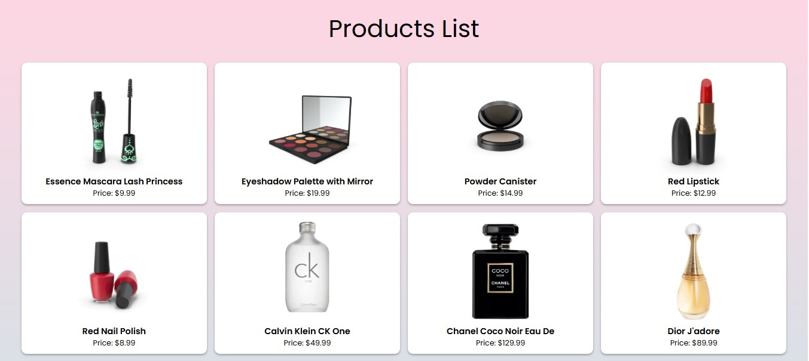
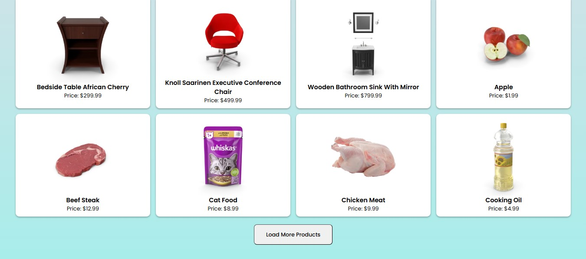

# 📦 Project 27 – Load More Products

🔸 **30 Days of JavaScript Projects – Day 28/30**

This is twenty-eighth project in 30 days JS Project Challenge...This project is a dynamic product listing page that fetches and displays products from a public API with a **"Load More"** feature. Users can keep loading 20 more products at a time until the full dataset is retrieved.

---

## 🚀 Features

- Fetches product data from [DummyJSON API](https://dummyjson.com/products)
- Displays products in a grid layout with image, title, and price
- "Load More Products" button loads additional 20 items each time
- Button disables after all products are loaded (total: 194)
- Loading and error messages provide better user experience
- Built using **HTML**, **CSS**, and **Vanilla JavaScript**

---

## 📸 Screenshots

---

## 🧠 What I Learned

- Handling pagination with `skip` and `limit` in API queries
- Managing dynamic DOM rendering using JavaScript
- Preventing duplicate renders by appending only new data
- Implementing UI state: loading, error, and max-limit reached
- Writing clean, reusable functions like `renderProducts`

---

## 🛠️ Tech Stack

- HTML5
- CSS3
- JavaScript (ES6+)
- [DummyJSON Products API](https://dummyjson.com/products)

---
