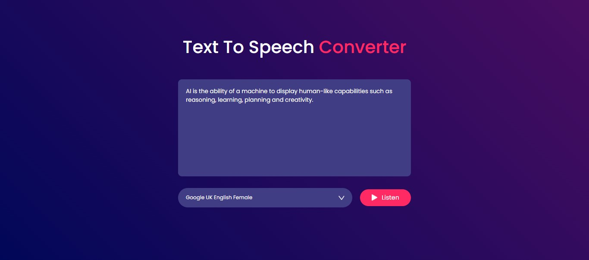

# 🗣️ Project 28 – Text to Speech Converter

🔸 **30 Days of JavaScript Projects – Day 29/30**

This project is a **Text to Speech Converter** built using **HTML, CSS, and JavaScript**. It allows users to enter any text and listen to it spoken aloud using the Web Speech API. Users can also choose from different available voices for a more personalized experience.

---

## 🚀 Features

- Converts input text into speech using browser's built-in voices
- Dropdown menu to select from available voice options
- Clickable **Listen** button triggers the speech
- Styled with a modern, gradient background and responsive layout
- Smooth and minimal UI interactions

---

## 📸 Screenshot

---

## 🧠 What I Learned

- Working with the **Web Speech API**
- Dynamically populating dropdowns using `getVoices()`
- Managing speech synthesis with `SpeechSynthesisUtterance`
- Handling voice change events and default voice fallbacks
- UI design and user experience for accessibility tools

---

## 🛠️ Tech Stack

- HTML5
- CSS3
- JavaScript (ES6+)
- Web Speech API

---
