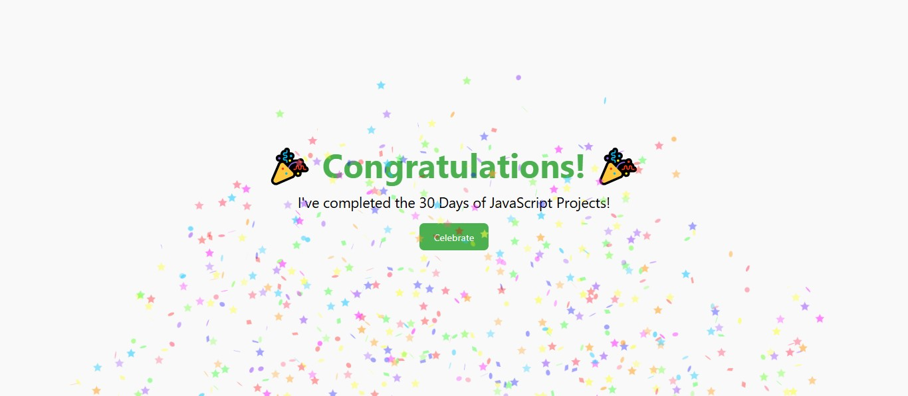

# 🎉 Project 29 – Confetti Celebration App

This project is part of my **30 Days of JavaScript Projects** challenge.

To celebrate completing the full journey, I created a simple but joyful **Confetti Celebration App** using **HTML, CSS, and JavaScript**. With a click of a button, a colorful burst of confetti fills the screen — a small tribute to the big milestone of consistency and growth! 🥳

---

## 🚀 Features

- 🎯 Confetti explosion on button click
- 🌈 Colorful, dynamic particles using `canvas-confetti`
- ⭐ Mix of fun shapes like `star`, `circle`, and `square`
- ⏱️ Layered bursts for extended celebration

---

## 📸 Screenshot

---

## 🧠 What I Learned

- Using external JavaScript libraries (`canvas-confetti`)
- Handling button click events
- Timing animations using `setTimeout`
- Playing with shapes, colors, and origin points for visual variety

---

## 🛠️ Tech Stack

- HTML5
- CSS3
- JavaScript (ES6+)

---
